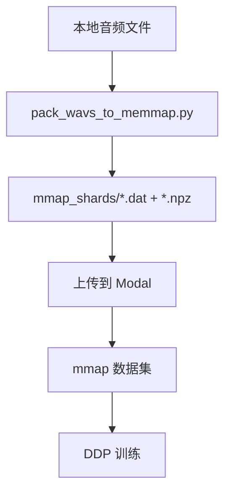

# mmap 音频系统使用指南

这个系统将音频文件打包成大的二进制分片，在 Modal 上使用 mmap 进行零拷贝随机读取，大幅提升训练效率。

## 🚀 快速开始

### 1. 打包音频文件

首先需要将分散的小音频文件打包成大的分片：

```bash
cd retriever/gigaspeech/modal
python pack_wavs_to_memmap.py
```

这会扫描以下目录：
- `/mnt/gemini/data1/jiaxuanluo/term_chunks/POD`
- `/mnt/gemini/data1/jiaxuanluo/term_chunks/YOU`
- `/mnt/gemini/data1/jiaxuanluo/term_chunks/AUD`

输出到 `./mmap_shards/` 目录，包含：
- `shard_00000.dat`, `shard_00001.dat`, ... (二进制音频数据)
- `shard_00000.index.npz`, `shard_00001.index.npz`, ... (索引文件)

### 2. 启动训练

```bash
modal run modal_qwen2_audio_training.py
```

系统会自动：
1. 检测 `./mmap_shards/` 目录
2. 上传分片文件到 Modal
3. 在训练中使用 mmap 数据集

## 📁 文件结构

```
retriever/gigaspeech/modal/
├── pack_wavs_to_memmap.py          # 音频打包脚本
├── mmap_audio_reader.py            # mmap 读取器
├── modal_qwen2_audio_training.py   # Modal 训练脚本（已更新）
├── Qwen2_Audio_term_level_train_ddp_simplified.py  # 训练脚本（已更新）
└── mmap_shards/                    # 打包后的分片（自动生成）
    ├── shard_00000.dat
    ├── shard_00000.index.npz
    ├── shard_00001.dat
    └── shard_00001.index.npz
```

## 🔧 技术细节

### 音频打包
- **格式**: int16（节省空间，训练时转 float32）
- **采样率**: 16kHz（统一）
- **分片大小**: 2GB/片（Modal 友好）
- **索引**: key（路径去后缀）→ (offset, length)

### mmap 读取
- **零拷贝**: 直接从磁盘映射内存
- **多进程安全**: 支持 DataLoader 多 worker
- **容错**: 音频读取失败时返回静音

### 数据集兼容
- **自动切换**: 如果存在 mmap 分片则使用，否则回退到传统方式
- **透明接口**: 训练代码无需修改

## 🎯 性能优势

| 方式 | 优势 | 劣势 |
|------|------|------|
| **传统** | 简单直接 | 大量小文件 I/O，上传慢 |
| **mmap** | 零拷贝，上传快，多进程友好 | 需要预处理 |

## 📊 使用流程



## 🔍 调试

### 测试 mmap 读取器
```bash
python mmap_audio_reader.py ./mmap_shards
```

### 检查分片内容
```python
from mmap_audio_reader import MMapAudioCollection

db = MMapAudioCollection("./mmap_shards")
print(f"Total samples: {len(db)}")
print(f"Sample keys: {list(db.k2loc.keys())[:5]}")

# 测试读取
wav, sr, key, rel = db.get_by_key(list(db.k2loc.keys())[0])
print(f"Audio shape: {wav.shape}, sr: {sr}")
```

## ⚠️ 注意事项

1. **磁盘空间**: 打包后的分片大约是原音频文件的 50%（int16 vs float32）
2. **内存使用**: mmap 不占用额外内存，但需要足够的虚拟地址空间
3. **并发**: 支持多进程读取，但写入时需要串行
4. **兼容性**: 自动回退到传统数据集，确保向后兼容

## 🚨 故障排除

### 问题：找不到音频文件
```
[INFO] Audio files not in mmap: 512866
```
**解决**: 检查 `extract_audio_key_from_path` 函数的路径解析逻辑

### 问题：分片文件过大
**解决**: 调整 `pack_wavs_to_memmap.py` 中的 `SHARD_BYTES` 参数

### 问题：内存映射失败
**解决**: 检查文件权限和磁盘空间


